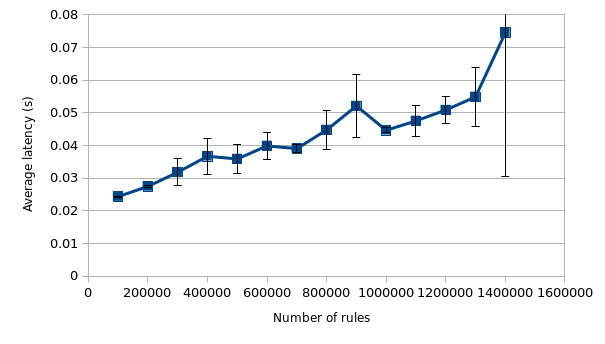
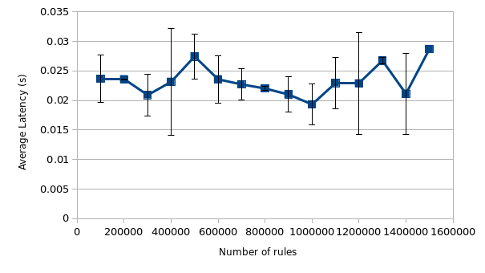
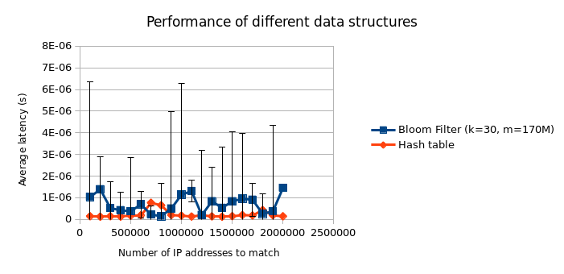
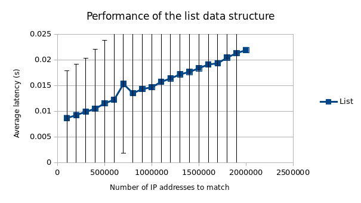

## Question 1:

The following scripts were used to send packets to my own laptop and receive
them to measure the time, respectively (see also `../scripts/iptables_send.py`
and `../scripts/iptables_rec.py`):

```python
#!/usr/bin/env python

from scapy.all import *

# See http://www.secdev.org/projects/scapy/faq.html, allows sending Scapy
# packets over the loopback interface.
conf.L3socket = L3RawSocket

src = RandIP()
loopback = "lo"
print("Using IP address", src, "on interface", loopback)

while(True):
    pkt = IP(src=src, dst="127.0.0.1")/UDP(dport=53)/DNS(rd=1, qd=DNSQR(qname=str("%f" % time.time())))
    send(pkt, iface=loopback)
    time.sleep(0.5)
```

```python
#!/usr/bin/env python

from scapy.all import *
import sys
import numpy

loopback = "lo"
latencies = []
count = 0

def recv(pkt):
    if not pkt[DNS]:
        return
    send_time = float(pkt[DNS].qd.qname[:-1])
    recv_time = float(pkt.time)
    latency = recv_time - send_time
    print("S:", send_time, "R:", recv_time, "L:", latency)
    latencies.append(latency)
    print("Packet received with a latency of", latency)

    global count
    count += 1
    if count == 10:
        print("10 packets received. Average latency:", sum(latencies) /
        len(latencies), "seconds, std dev:", numpy.std(latencies))
        sys.exit(0)

sniff(iface=loopback, prn=recv)
```

Thus, per step (100K rules, 200K rules, et cetera) 10 packets were sent and
their average latency taken. The following Bash for-loop was used (as root) to
iterate over all the steps and collect the data. Note that for some reason my
laptop would not accept rule sets larger than 1.5M, so sadly this is the maximum
I could measure.

```bash
for i in "100K" "200k" "300K" "400k" "500K" "600k" "700K" "800k" "900K" "1M" "1.1M" "1.2M" "1.3M" "1.4M" "1.5M"; do
    iptables-restore < iptables/$i\_ips.txt
    ./scripts/iptables_rec.py
    read -p "Continue?"
done
```

The result can be seen in [Figure 1](#iptables-performance). From this figure,
we can conclude that the algorithm iterates over all the rules linearly. The
time to check a packet against all rules thus increases proportionally with the
number of rules, e.g. the complexity of the matching algorithm is O(n).

<div id="iptables-performance">



_Figure 1: iptables matching algorithm performance_

## Question 2a:

Since iptables has to iterate over all the rules to find a matching one, this
process can be sped up significantly by ordering the rules in such a way that
those with a high probability of matching are in the beginning of the tables. In
this way, most packets are processed fast(er). This is illustrated in [Figure
2](#iptables-performance-rule-order), where a rule was added to ACCEPT any packet
from IP 33.33.33.33. The sending Python script above was modified to use this
static IP. As can be observed, the time spent inside iptables is constant up to
a millisecond.

<div id="iptables-performance-improved">



_Figure 2: iptables matching with high a probability match first_

## Question 2b:

Another way to improve the performance of iptables is to use a dataset that can
be searched non-linearly, such as a hash table or as mentioned in the
assignment, ipsets. Ipsets is an extension to iptables where a rule is matched
on a set of IP addresses. This set data structure is indexed and can thus be
searched efficiently. My laptop isn't the fastest laptop around (understatement
of the year), so I only measured the performance increase for 100K IP addresses:

```bash
ipset create myset hash:next
for addr in $(grep -o '[0-9]\{1,3\}\.[0-9]\{1,3\}\.[0-9]\{1,3\}\.[0-9]\{1,3\}' iptables/100K_ips.txt); do
    ipset add myset $addr
done
iptables -I INPUT -m set --match-set myset src -j DROP
```

The above commands are taken as per [Arch Linux' Wiki
page](https://wiki.archlinux.org/index.php/Ipset) on ipset. After 65544 hashes,
the hash set was full and I aborted the for-loop. While the results are thus not
really comparable as-is, they do give an indication of the performance
improvement. With 65544 hashes in the set, the average latency over 10 packets
is 0.0206 seconds with a standard deviation of 0.0002 seconds. This is slightly
faster than the 100K rules in both previous scenarios, but the difference is
assumed to increase with the number of rules.

## Question 3:

For the implementation of the Bloom Filter and the code to measure the
performance of the different data structures, please see `../bloom.go`. This
code reads the IP addresses to store into the data structures from standard
input, which are given using a Bash for-loop again:

```bash
for i in "100K" "200k" "300K" "400k" "500K" "600k" "700K" "800k" "900K" "1M" "1.1M" "1.2M" "1.3M" "1.4M" "1.5M" "1.6M" "1.7M" "1.8M" "1.9M" "2M"; do
    grep -o '[0-9]\{1,3\}\.[0-9]\{1,3\}\.[0-9]\{1,3\}\.[0-9]\{1,3\}' iptables/$i\_ips.txt | ./bloom
    read -p "Continue?"
done
```

As you can see, for this question I did manage to use all two million IP
addresses. When the data has been read, a random IP address is generated which
is then looked up in all data structures. This search is done in a separate
goroutine (thread) for each datastructure, to speed up the program. The function
performing the iteration is `time`, which searches for the target IP using a
function/closure given as an argument. Again, the average latency of 10 lookups
is taken. The data is presented in [Figure 3](#iptables-performance-ds) and
[Figure 4](#iptables-performance-list).

<div id="iptables-performance-ds">



_Figure 3: the performance of the Bloom Filter and the Hash table_

<div id="iptables-performance-list">



_Figure 4: the performance of the List_
